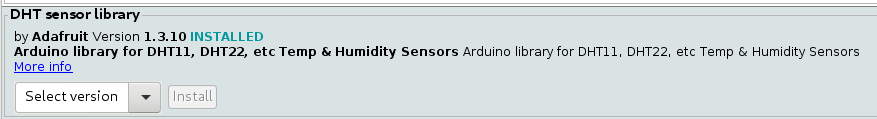

# Smart Garden

## Sobre

O objetivo principal desse projeto é poder monitorar um jardim, o irrigando automaticamente, e coletando dados sobre o ambiente para geracao de graficos e alertas.

Esse projeto foi criado para as aulas de IOT na fiap, em cada tag se encontra versionada uma aula, confira o [CHANGELOG](CHANGELOG.md). para mais informações.

As tags `v1.x.x` são das aulas do primeiro semestre e as `v2.x.x` são do segundo semestre.

## Materiais

* `1 Arduino Uno e cabo serial`

* `1 sensor higrometro`

* `1 sensor LDR`

* `1 sensor DHT11`

* `1 protoboard`

## Cabeamento

Link com exemplo no [tinkercad]().

## Dependencias

Instale a lib do DHT e todas as dependecias que ele pedir para instalar junto, a lib correta esta no print a seguir:

As versoes da familia v2.x.x dependem tambem da lib `ArduinoJson`.

## Integração

Usaremos um raspberry para receber dados de algumas maneiras diferentes durante as aulas, porém isso pode ser feito no seu computador caso não tenha um raspberry.
